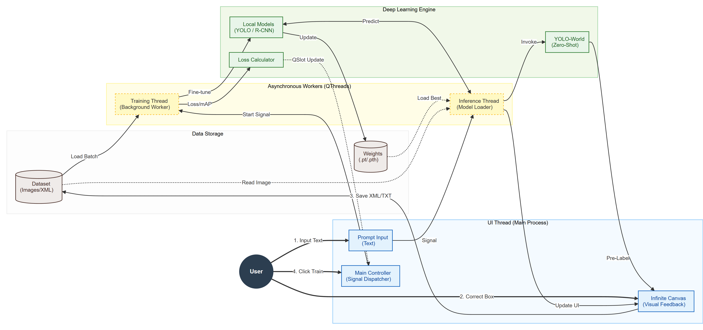

# AutoLabel Pro: Real-Time Human-in-the-Loop Annotation System

<p align="center">
  <!-- 建议将你的Logo或者主界面截图放在这里 -->
  
</p>

<p align="center">
  <a href="https://opensource.org/licenses/MIT"></a>
  <a href="https://www.python.org/"></a>
  <a href="https://pytorch.org/"></a>
  <a href="https://riverbankcomputing.com/software/pyqt/intro"></a>
  <a href="https://github.com/ultralytics/ultralytics"></a>
</p>

---

**AutoLabel Pro** is an intelligent, data-centric annotation tool designed to accelerate object detection labeling workflows.

Unlike traditional tools (like LabelImg) that act as static drawing boards, AutoLabel Pro integrates **YOLO-World** for zero-shot "Cold Start" and a **Background Training Engine** that fine-tunes local models in real-time as you label. This creates a closed **Human-in-the-Loop (HITL)** feedback cycle, significantly reducing manual effort.

## 📸 Demo & Architecture

<p align="center">
  <!-- 请确保你在 assets 文件夹下放了一个 demo.gif -->
  
</p>

### System Architecture
The system adopts a multi-threaded **Producer-Consumer** architecture to ensure the UI remains frozen-free during heavy inference and training tasks.

<p align="center">
  <!-- 请确保你在 assets 文件夹下放了 workflow.png -->
  
</p>

---

## 🌟 Key Features

- **🚀 Zero-Shot Cold Start**  
  Powered by **YOLO-World**, label unseen objects (e.g., "giant panda", "smoke", "safety helmet") using natural language prompts without any prior training.

- **🔄 Real-Time Model Distillation**  
  The **Training Worker** runs in the background. As you correct annotations, it automatically fine-tunes a lightweight edge model (e.g., YOLOv11n) to learn from your feedback instantly.

- **🔒 Privacy First**  
  All processing (Inference & Training) happens **100% locally**. No data is uploaded to the cloud, ensuring data security for medical and industrial applications.

- **⚡ Infinite Canvas & Smooth UI**  
  Built with highly optimized PyQt5 `QGraphicsScene`, supporting pixel-perfect zooming, boundary clamping, and non-blocking interactions.

- **📂 Universal Compatibility**  
  Seamless bidirectional conversion between **YOLO (.txt)**, **Pascal VOC (.xml)**, and **COCO (.json)** formats.

---

## 🦁 Model Zoo

AutoLabel Pro supports a comprehensive range of SOTA detectors via a modular backend:

| Series | Models | Use Case |
| :--- | :--- | :--- |
| **Foundation Models** | `yolov8s-worldv2`, `yolov8m-worldv2` | **Zero-Shot Cold Start** (Prompt-based) |
| **YOLO Series** | `yolov8n` - `yolov8x`, `yolo11n` - `yolo11x` | **Real-time Fine-tuning** & Edge Deployment |
| **Transformers** | `rtdetr-l`, `rtdetr-x` | High-accuracy scenarios |
| **Classic CNNs** | `Faster-RCNN`, `SSD`, `RetinaNet` | Legacy support (Torchvision) |

---

## 🛠️ Installation

### Prerequisites
- Windows / Linux / macOS
- Python 3.8+
- CUDA (Recommended for real-time training)

### Step 1: Clone the repository
```bash
git clone https://github.com/lucygan113/AutoLabel-Pro.git
cd AutoLabel-Pro
```

### Step 2: Install dependencies
```bash
pip install -r requirements.txt
```


### step 3: Run the application
```bash
python main_app_v5.py
```

## 📖 Quick Start Workflow

## Load Data: 
Click `Load Dataset Dir` to open your image folder.
## Cold Start:
Select `yolov8m-worldv2` from the model dropdown.
Enter your target object (e.g., `giant panda`) in the **Prompt Input**.
The system will auto-generate labels.
## Human Correction:
Correct any missing or wrong boxes manually.
## Background Training:
Click `Start Training`. The system will fine-tune a local model (e.g., `yolov11n`) in the background.
Watch the Loss curve drop in the monitor panel.
## Model Switch:
Once training is done, switch to the fine-tuned `yolov11n`. It should now recognize your custom objects faster and more accurately.

## ⌨️ Shortcuts

| Key | Action |
| :--- | :--- |
| **A / D** | Previous / Next Image |
| **R** | Toggle Draw Mode (Rectangle) |
| **Delete** | Delete Selected Box |
| **Ctrl + S** | Save Annotation (Auto-save supported) |
| **Ctrl + Scroll** | Zoom Canvas |
| **Mouse Middle** | Pan Canvas |

---

## 📜 Citation

If you find this project useful for your research, please consider citing:

```bibtex
@misc{autolabelpro2026,
  title={AutoLabel Pro: A Real-Time Human-in-the-Loop System for Data-Centric Object Detection},
  author={Your Name},
  year={2026},
  publisher={GitHub},
  journal={GitHub repository},
  howpublished={\url{https://github.com/lugan113/AutoLabel-Pro}}
}
```

### Acknowledgements
This project is built upon the amazing work of [Ultralytics](https://github.com/ultralytics/ultralytics) and [YOLO-World](https://github.com/AILab-CVC/YOLO-World).


